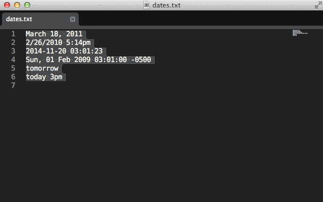

# Date Formatter

Select a date, choose a format, reformat.



## Requirements

To use Date Formatter, **you must have PHP installed**.

## Installation

First, make sure you have a PHP CLI interpretter installed.

### Sublime Package Control

You can install Date Formatter using the excellent [Package Control][] package manager for Sublime Text:

1. Open "Package Control: Install Package" from the Command Palette (`Shift + Command + P`).
2. Select the "Date Formatter" option to install.

[Package Control]: http://wbond.net/sublime_packages/package_control

### Git Installation

To install manually, clone to your "Packages" directory.

```
git clone https://github.com/pjdietz/sublime-date-formatter.git "Date Formatter"
```

**Note:** Date Formatter expects to be installed to a directory called "Date Formatter".

## Using

Date Formatter uses PHP's [`stringtotime()`](http://php.net/manual/en/function.strtotime.php) and [`date()`](http://us2.php.net/manual/en/function.date.php) functions to magically parse just about any string representation of a date or time and format it any way you'd like.

1. Start by making a selection. You can select one date or several using multiple selections.
2. Open the Command Palette with `Command + Shift + P` (OSX) and begin typing "format date". Select it when you see it in the list.
3. Select the format you would like from the quick panel. Each item in the panel will contain a preview of the format using the first selected date.
4. When you select the format, Date Formatter will replace each selected date with a reformatted version.

## Configuration

Create a user settings file to configure Date Formatter. There are a couple things you can configured.

### PHP Setup

The most important thing to configre is the path to PHP. If PHP in installed on your system with `php` on the path, you can leave this as the default. Windows users will need to provide the path using forward slashes. Here's an example:

```json
{
    "php": "C:/php/php.exe"
}
```

To customize the available formats, look at the `formats` setting. This setting must be a list. Each item of the list can either be:

- A string containing a date format
- A list containing a date format string and a label

The label will appear in the quick panel and can be anything you like. For help with the syntax for the date format strings, see the PHP manual's page on [`date()`](http://us2.php.net/manual/en/function.date.php).

Here are the default formats:

```json
{
    "formats": [
        ["Y-m-d",       "SQL Date"],
        ["Y-m-d H:i:s", "SQL Date Time"],
        ["c",           "ISO 8601"],
        ["r",           "RFC 2822"],
        "m/d/Y"
    ]
}
```

### Custom Commands

You may want to add custom commands to the command palette for date formats you use frequently. To do this, create a new file in your `Packages/User/` directory with the extenstion `.sublime-commands`. The syntax for the file looks like this:

```json
[
    {
        "caption": "Format SQL Date",
        "command": "format_date",
        "args": {"format": "Y-m-d H:i:s"}
    }
]
```

## More Fun

### Insert Today's Date

If you use the Format Date command with an empty selection, it will insert a formatted string of the current time.

### Relative Dates

PHP's `strtotime()` is pretty magical. It can even handle relative dates like `tomorrow`, `yesterday`, `next Thursday`, and `1 week 2 days 4 hours 2 seconds`. Play around with, and check out the PHP manual page on [`stringtotime()`](http://php.net/manual/en/function.strtotime.php).


## Author

**PJ Dietz**

+ [http://pjdietz.com](http://pjdietz.com)
+ [http://github.com/pjdietz](http://github.com/pjdietz)
+ [http://twitter.com/pjdietz](http://twitter.com/pjdietz)

## Copyright and license
Copyright 2013 PJ Dietz

[MIT License](LICENSE)
